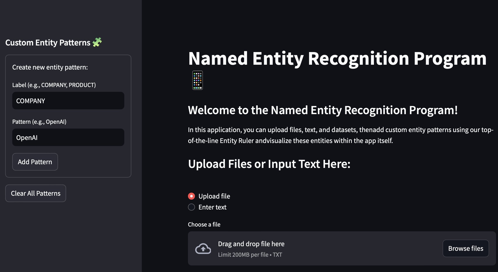
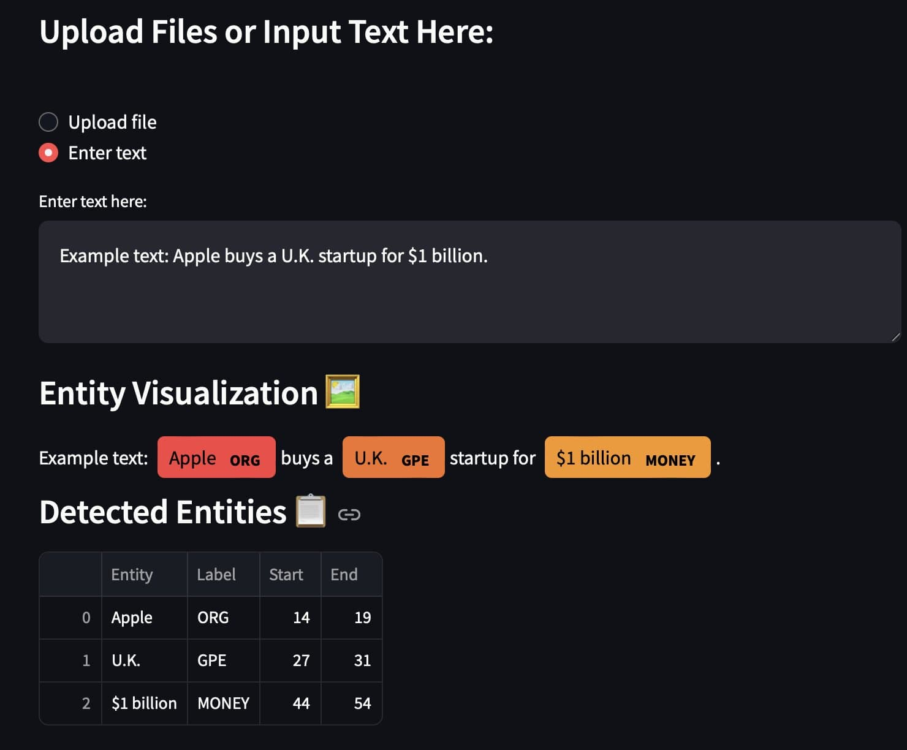
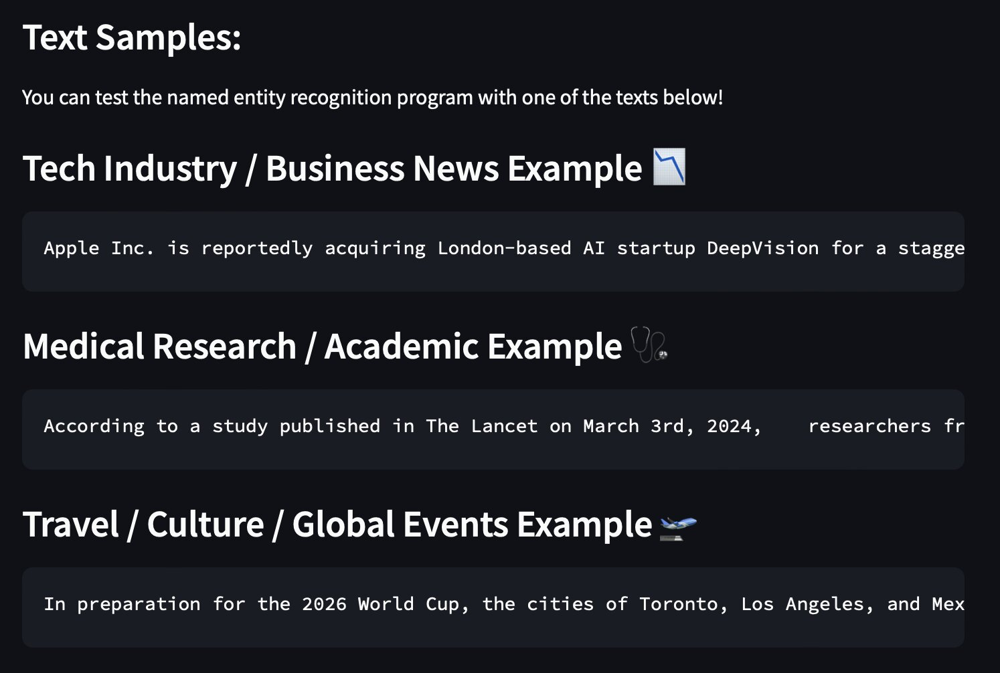
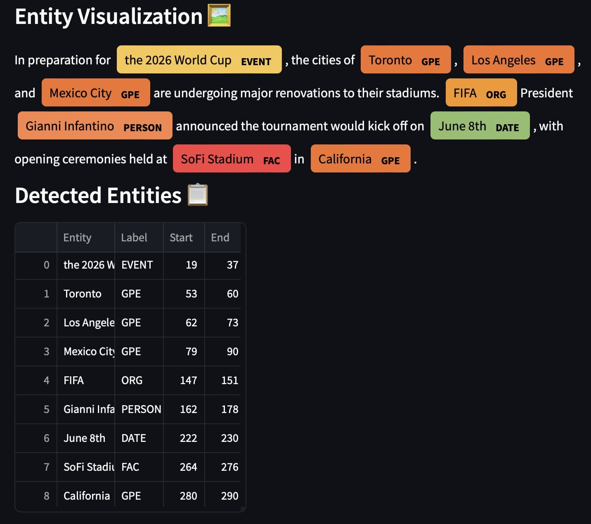

# Named Entity Recognition Program!📱

### 🔗 [Link](https://ner-main.streamlit.app) to NER Streamlit App.

🔍 Skills At a Glance:
- Natural language processing
- spaCy library implementation
- Custom entity configuration
- Text visualization
- File handling
- User interface design
- Text analysis

This is the home page README file for my Named Entity Recognition (NER) Application project. I hope this page serves as a useful tool, providing insight into how the app functions and its overall purpose.

## Contents:
- 🧩[Project Overview](#project-overview)
- 👩‍💻[App Features](#app-features)
- 📋[Instructions](#instructions)
- 🖼️[Visual Examples](#visual-examples)
- 📕[References](#references)

## Project Overview 🧩:
In this project, I built a **Named Entity Recognition Program**. This purpose of this project is to increase my app development skills as well as familiarizing me with entity recognition software. I combined these skills with my past knowledge in streamlit to create a fully functional program. 

Throughout this project, I utilized spaCy, which is a dictionary-based approach to NER that relies on labels and patterns to identify entities. It allows users to utilize the **EntityRuler** approach to define custom patterns and recognize entities in a given text. 

## App Features 👩‍💻:
**Ability to Upload or Input Text:**
- In this application, you can either upload a local .txt file or type into the textbox with custom texts.
- These options allow for NER analysis of long format text as well as quick analysis of short phrases, respectively.

**Ability to Create an Entity Ruler:**
- Users can utilize the sidebar to create custom Entity Rulers, allowing for flexibility and customization depending on the text with which you are working.

**Ability to Work with spaCy's Model**
- This NER Program is directly integrated with spaCy's 'en_core_web_sm' model, which detects common entity types. 
- These common types include people, places, companies, and more.

**Ability to Recognize Multi-Word Patterns**
- Another key aspect of this application is its ability to recognize multi-word patterns, meaning that it can fully process full organization names, titles, or phrases.

**Entity Visualization**
- All detected entities are colored using a predetermined color palette, highlighting identified entities and contributing to the overall cohesiveness of the application. 
- Each entity is also identified below the visualization with its label, start, and end.

**Text Examples**
- In order to provide users with text to work with, there are three paragraphs of text located below the uploading and entity visualization sections. 
- The textbox also comes pre-loaded with a text example.

## Instructions 📋:
1. The first step of running this application is downloading the 'ner_main.py' file from this GitHub repository.

2. In order to run this application, there are three required libraries:
- Streamlit
- spaCy
- Pandas

Before beginning, the user must install these libraries in the terminal (not in the python file itself!). The commands required to do so are as follows:

    { 
        pip install streamlit
        pip install pandas
        pip install spacy
        python -m spacy download en_core_web_sm
    }

3. In order to run the app locally, one must also execute an additional command in the terminal. The command is as follows:

    {
        streamlit run main.py
    }

If that does not work, you can access it using this [link](https://dubay-python-portfolio-gsgqtjqzwrn4jq8zcsruby.streamlit.app).

4. You can now use the Named Entity Recognition Program! You have the option to upload files, input text, customize entity patterns, visualize entities via graphs, and more!

## Visual Examples 🖼️:

##### This is the page that greets the user when they open the app. It automatically defaults to the upload file option, and will not display the Entity Visualization or Detected Entities categories until text is inputted.

##### When the user selects the "Enter text" option, this is what they will see. There is a sentence automatically entered in the box, prompting the Entity Visualization and Detected Entities categories to appear.

##### If the user were to scroll down (either before or after entering text), they would see three text examples. These can be copied and pasted into the textbox.

##### Finally, if the user were to enter one of the text examples in the textbox (in this case, it would be the "Travel / Culture / Global Events example), this is what the application would return.

## References 📕:
- [Streamlit Cheat Sheet](https://docs.streamlit.io/develop/quick-reference/cheat-sheet)
- [spaCy EntityRuler](https://spacy.io/api/entityruler)
- [Markdown Extended Syntax – Markdown Guide](https://www.markdownguide.org/extended-syntax/)
- [Standard Markdown Syntax](https://www.markdownguide.org/basic-syntax/)
- [Code Markdown Syntax](https://www.markdownguide.org/extended-syntax/)
- [Linked Headings](https://gist.github.com/rachelhyman/b1f109155c9dafffe618)
- [Troubleshooting and Questions](https://chatgpt.com)
