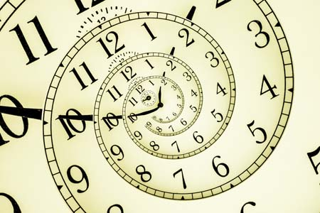
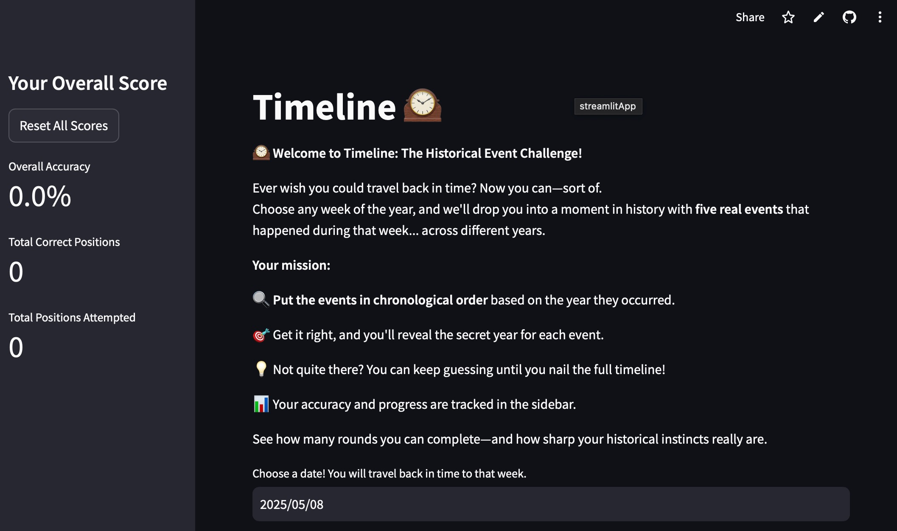
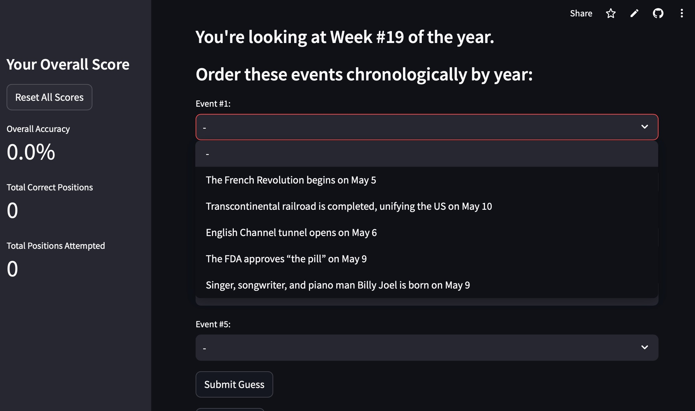
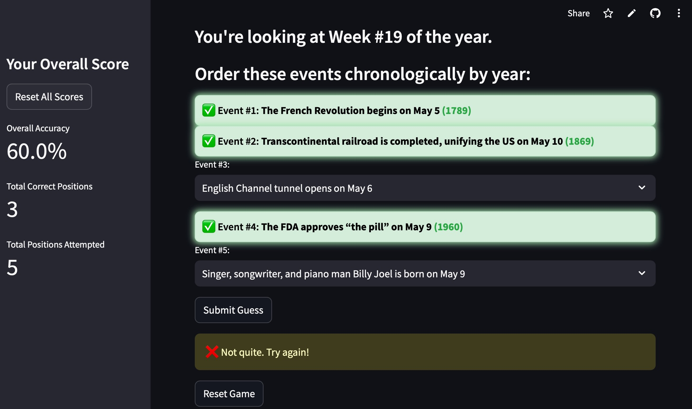
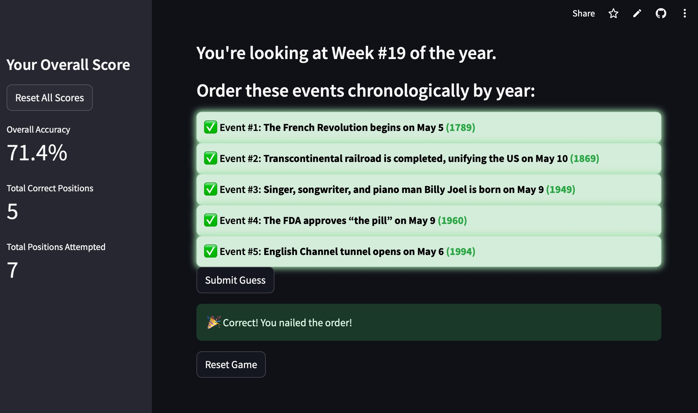

# Timeline: The Historical Event Challenge! 🕰️

### 🔗 [Link](https://timeline-final.streamlit.app) to Timeline Streamlit App.

This is the home page README file for my Streamlit Final Project. I hope this page provides insight into why I created this app as well as teaches those about the programming behind it. 

## Contents:
- 🧩[Project Overview](#project-overview)
- 👩‍💻[App Features](#app-features)
- 📋[Instructions](#instructions)
- 🖼️[Visual Examples](#visual-examples)
- 📕[References](#references)

## Project Overview 🧩:
In this project, I built Streamlit game called **Timeline**, which was based on the New York Times mini game, Flashback. The purpose of this project is to tap into my creative side, allowing me to fully brainstorm, design, and code my own application. I also created this game to teach people that coding– and history!– can be really fun when you add a twist. I hope it not only encourages people to brush up on their history facts, but also to make them excited about the endless possibilities of coding.

I created my own dataset for this project, in which I chose five events from each week of the year. These events span centuries and make for a fun historical quiz game in which the player must sort the events chronologically. The application also keeps track of your overall accurracy for a more competitive twist. 😁

## App Features 👩‍💻:
**Choosing a date:**
- At the start of the game, users must select a date. It automatically starts with the current date, but they can choose any date of the year (present, past, and future!). 
- Based on this selection, the program will tell you which Week Number you will be working with.

**Ordering the events:**
- Users can click on the select box under "Event #1" to "Event #5", under which they will see the five historical events they are responsible for ordering. These will include a description and date, but not the year.
- Users must fill the five event boxes with the given events, choosing what they believe to be the correct chronological order.

**Submission and grading:**
- Once the submit button is pushed, the events that have been placed in the correct spot will grow bright green and display the year in which they took place. If the user gets all events correct, they will see a congratulatory message at the bottom.
- The events in the wrong place will remain the same color as before. If the user gets any events wrong, they will see a warning message at the bottom. Users can resubmit their answers until all five events are in the correct position.

**Scoring and resetting:**
- The game keeps track of the player's guesses in the sidebar that displays their overall score. There is an accuracy % section, based on the total correct events placed and the total events placed.
- If the user would like to reset their score, they simply must press the "Reset All Scores" button. They will get a warning message before resetting.

## Instructions 📋:
**If running from code:**
1. The first step of running this app directly from its code is downloading the 'final.py' file from this GitHub repository.

2. In order to run this application, there are two required libraries:
- Streamlit
- Pandas

Before beginning, the user must install these libraries in the terminal (not in the python file itself!). The commands required to do so are as follows:

    { 
        pip install streamlit
        pip install pandas
    }

3. In order to run the app locally, one must also execute an additional command in the terminal. The command is as follows:

    {
        streamlit run final.py
    }

4. You can now play Timeline! View further instructions below:

**If accessing via deployed app:**
1. If someone is playing this game directly from their web browser, they must simply navigate to the website using this [link](https://timeline-final.streamlit.app).

2. Once in the game, the player must choose a date to work with. 

3. This date will generate a week number and five random events from that week in the past under the 'Event' select boxes.

4. The player must order these events chronologically by year. If they got any correct, the correct events will glow green. If they made any mistakes, the incorrect events will remain the same color, and they will receive a warning at the bottom. 

5. The players can try again until all of their answers are correct. Once they are all correct, they will receive a congratulatory message at the bottom.

6. Players can view their overall accuracy score in the sidebar. This updates with every guess submitted.

7. Players can reset the game or their score at any time.

## Visual Examples 🖼️:
##### This is the page that greets the user when they open the app. It automatically defaults to the day the app was opened. The user's accuracy is displayed in the sidebar.

##### When the user selects a date (or keeps the automatically assigned one), they will see the week of the year that the date falls within. They will also see the five events from that week.

##### The user will select the order they think the events happened in. If they are correct, it will glow green. If they are incorrect, the event will stay the same color and they will receive a warning message at the bottom.

##### The user can resubmit their answers until all five events are in the correct spot. When this happens, they will receive a congratulatory message at the bottom.

## References 📕:
- [This Day in History](https://www.history.com/this-day-in-history/march-18)
- [ChatGPT](https://chatgpt.com)
- [ClaudeAI](https://claude.ai/new)
